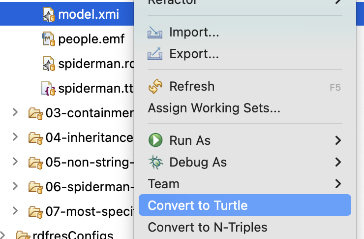

# EMF resource for RDF graphs

This repository includes a prototype implementation of an EMF resource for RDF graphs, on top of [Apache Jena](https://jena.apache.org/).

It can be installed from the repository's update site: see [below](#installation) for details.
It is also available as a Maven artifact.

This RDF-EMF resource produces an EMF model representation of an RDF model; this could be an EMF model saved as RDF, or an RDF model from another program.
One or more RDF model files and schemas can be combined/reasoned before being deserialised against an EMF Ecore metamodel.
An EMF model instance is composed of `EObject`s for the RDF model element that have `rdf:type` statements that match an `EClass` in the configured Ecore metamodel(s).

The repository includes a read-only [Epsilon Model Connectivity driver](./EMC.md) as well.

## Installation

### Eclipse IDE

Install the features from this update site:

https://epsilonlabs.github.io/emf-rdf/updates/

Alternatively, you can download a [zipped version](https://epsilonlabs.github.io/emf-rdf/updates.zip) of the update site.

Example projects are available from the [`examples`](./examples) folder of this repository.

### Maven

The EMF resource is available as a Maven dependency from [Github Packages](https://docs.github.com/en/packages/working-with-a-github-packages-registry/working-with-the-apache-maven-registry):

```
<dependency>
  <groupId>org.eclipse.epsilon</groupId>
  <artifactId>org.eclipse.epsilon.rdf.emf</artifactId>
  <version>1.0.0-SNAPSHOT</version>
</dependency>
```

## Differences with emf-triple

This implementation has some major differences with [emf-triple](https://github.com/ghillairet/emftriple):

* A single resource can combine information from multiple sources (e.g. Turtle or RDF/XML files).
* OWL inference is supported.

These differences are achieved by loading an intermediary `.rdfres` file with all the data and schema models to be combined, as well as any relevant options.

## Current limitations

Saving has only been tested against file-based locations. We have not tested saving into triple stores.

The resource assumes that the EPackage nsURI and the RDF nsURI used for `rdf:type` subjects and for property statements (e.g. `metamodel:featureName`) are a close match to each other.
Specifically, we support two options:

* RDF namespace IRI = EPackage nsURI (including any trailing separator, such as `#` or `/`).
* RDF namespace IRI = EPackage nsURI + "#".

Namespaces for creating EMF models must be configured in the `.rdfres` (see  Default model namespace section below).
At the moment, the same namespace URI is used for every EObject created by the resource.

The contents of the resource must only be changed *after* it has been loaded.
The resource assumes that a Jena graph is present to be synchronised whenever a change is made to the contents of the resource.

## .rdfres file format

Suppose you have a `model.ttl` Turtle file with some statements of interest, written against an ontology in `schema.ttl`.

Suppose as well that the RDF resources in `model.ttl` follows certain conventions that relate them to an Ecore metamodel, in the [MOF2RDF](https://www.omg.org/spec/MOF2RDF/1.0/About-MOF2RDF) style:

* There are `rdf:type` predicates from the RDF resource to another RDF resource whose namespace URI is `ePackageNamespaceURI`, and local name is `eClassName`.
* Statements use predicates whose namespace URIs are `ePackageNamespaceURI` and local names are `eStructuralFeatureName`:
  * Predicate objects can be other RDF resources (in the case of `EReference`s), or literals (in the case of `EAttribute`s).
  * RDF lists are supported for many-valued features.

In that case, you could write an `.rdfres` file like this, and load it as an EMF resource where the relevant RDF resources would be deserialised into EMF `EObject`s:

```yaml
dataModels:
  - model.ttl
schemaModels:
  - schema.ttl
```

The `.rdfres` file can then be loaded and used by any EMF-compatible tool as usual.
Note that the elements in `dataModels` and `schemaModels` can be arbitrary URIs understood by the [RIOT](https://jena.apache.org/documentation/io/) system in Jena, and not just relative paths from the folder of the `.rdfres` file.

### Model validation

RDF model validation can be enabled by adding a line in the `.rdfres`, e.g. `validationMode: jena-clean`. The following validation modes are available :

- none
- jena-valid: validation passes if the model has no internal inconsistencies, even though there may be some warnings.
- jena-clean: validation passes if the model has no internal inconsistencies and there are no warnings.

```yaml
validationMode: jena-clean
dataModels:
  - model.ttl
schemaModels:
  - schema.ttl
```

### Multi-value attributes

`EAttribute`s with cardinality > 1 ("multi-value attributes") are supported by the resource.
This includes support for the `unique` and `ordered` flags.

Note that unique values are not enforced by RDF: the resource leaves it to EMF `EList`s to ensure uniqueness of values.
Duplicates in an RDF data model are persisted when handled as an EMF model.
Removing a value from a unique where there are duplicates of a value will remove all instances of the duplicate value: this maintains an equivalence between EMF and RDF represenations of the model.

The resource represents multi-value attributes in RDF using [Containers](https://www.w3.org/TR/rdf-schema/#ch_containervocab) or [Lists](https://www.w3.org/TR/rdf-schema/#ch_collectionvocab).
The resource will opt to update the RDF representation of a multi-value attribute based on its current data structure (container/list) in the RDF data model.
However, when there is no existing structure, by default a container will be used.
If you would prefer to use lists for representing multi-value attributes, you can specify `multiValueAttributeMode: List` in the `.rdfres` file, as follows:

```yaml
validationMode: jena-clean
dataModels:
  - model.ttl
schemaModels:
  - schema.ttl
multiValueAttributeMode: List
```

### Default model namespace

A default model namespace URI is required when adding new resources to an RDF model.
The namespace URI can be configured in the `.rdfres` file as shown below.

```yaml
defaultModelNamespace: http://foo/bar/example#
```
The URI must be absolute, e.g. by starting with `file://` (`/` will become file) or `http://`.
If you provide an invalid URI, then Jena will revert to using the URI of the named model it loaded the RDF from as the name space. 

The example above results in new RDF node with an IRI composed of the default name space and a UUID for the new EObject. E.g. `http://foo/bar/example#_6sDDMIgJEfC2g6UdYdL1hg`

If a default model namespace is not provided in the `.rdfres` file, the resource will fall back to the blank prefix `PREFIX : <URI>` in the RDF model.
The last resort is to let Jena decide, which will use the URI that the RDF model was loaded from.

### Working with RDF XML literals

RDF supports defining [XML literals](https://www.w3.org/TR/rdf-syntax-grammar/#section-Syntax-XML-literals), whose content is an XML document fragment.
These are parsed by the underlying Jena library as instances of [DocumentElement](https://docs.oracle.com/javase/8/docs/api/org/w3c/dom/DocumentFragment.html).

If you need to deserialise a property whose values will be XML literals, we recommend defining in your metamodel an EMF `EDataType` whose `instanceClassName` is DocumentFragment.
You can then use it as the data type of any relevant attribute.
For example, in the [Eclipse Emfatic](https://eclipse.dev/emfatic/) notation, it would look like this:

```
datatype EXMLLiteral : org.w3c.dom.DocumentFragment;

class Requirement {
  attr EXMLLiteral title;
}
```

In modularised Java codebases, accessing this feature via reflection (e.g. from an [Epsilon](https://eclipse.dev/epsilon/) program) may cause an error message like this:

```
module java.xml does not "exports com.sun.org.apache.xerces.internal.dom" to unnamed module
```

In this case, you may need a flag like the following to your JVM options:

```
--add-opens=java.xml/com.sun.org.apache.xerces.internal.dom=ALL-UNNAMED
```

## Converting an XMI file to RDF formats

The "Developer Tools for RDF binding for EMF" feature includes converters from XMI to the [Turtle](https://www.w3.org/TR/turtle/) and [N-Triples](https://www.w3.org/TR/n-triples/) serialisation formats for RDF.

To use them, right-click on a file with the `.xmi` or `.model` extensions in the Eclipse "Project Explorer" or "Package Explorer" views, and select the appropriate option:


